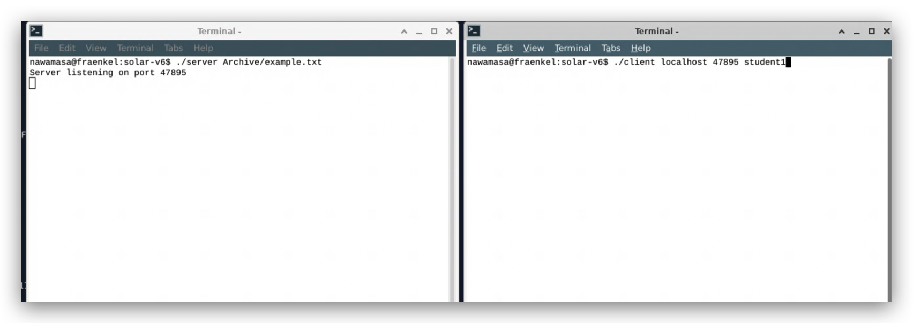
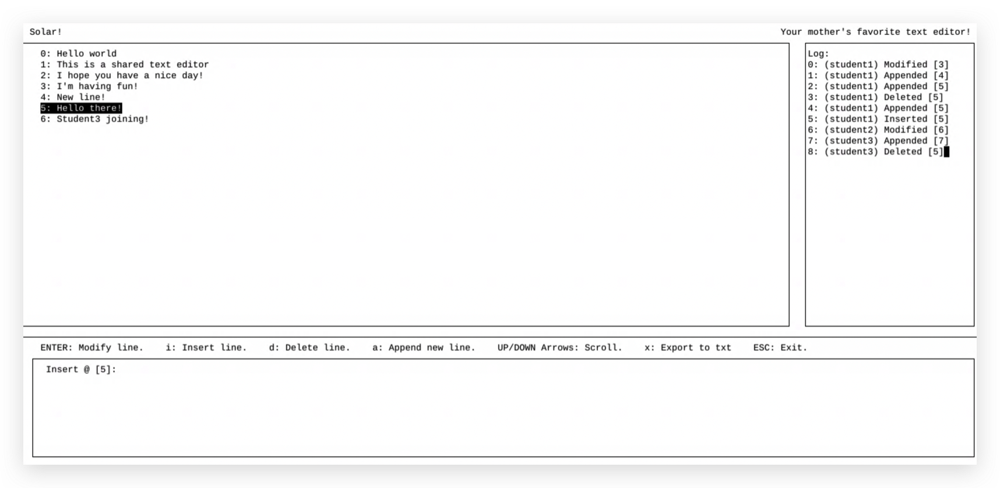

# Solar Shared Editor

## Introduction

Solar is a command line shared text editor built for the final project in Grinnell College's Operating Systems course. This program allows users to collaborate and make changes to the file in real time. This editor has a more stringent quality control and conflict-prevention mechanism than Google Docs/Microsoft Word, meaning users can only edit/create one line at a time and have exclusive control over that line for the length of their edit. This feature prevents conflicts from arising when multiple users edit a shared file simultaneously. The program is written in C and employs principles such as distributed systems, file systems, and thread synchronization to provide a shared editing system with a file-exporting function.

## Technologies

- C
- LINUX environment
- Terminal/Command line

## Instruction

### 1. Create a file that you want to work on

Create a txt file manually in your folder or use the following command to create one using the terminal:

```
$ touch <filename>
```

### 2. Compilation

Complie the program using the following command:

```
$ make
```

### 3. Run server

To start running the server, run the following command with a path to your file that you created in the first step:

```
$ ./server <filename>
```

### 4. Join session

To start editing, connect to the server created using the following commands:

```
$ ./client <server name> <port> <user name>
```

Insert your IP address in <servername> if you are running this program on a machine that is different from the one that created the server. If you are using a Grinnell computer, type the name of the machine to connect. If you are running the program on the same computer as the one that created the server, type `localhost` instead.

An example running the program:

```
$ ./client localhost 99999 student
```

### 5. Client Controls

The following are the available controls for users to edit the file:

- `ENTER`: Modify the current line
- `I`: Insert a new line
- `D`: Delete the current line
- `A`: Create a new line at the end
- `X`: Overwrite the file contents to a new one
- `esc`: Exit session

### 6. Quit server

Press `control + c` to terminate the server.

## Demo





## Software Architecture


## Reference

- `message.c`, `server.c`, `socket.h` and `client.c` adapted from https://curtsinger.cs.grinnell.edu/teaching/2022F/CSC213/
